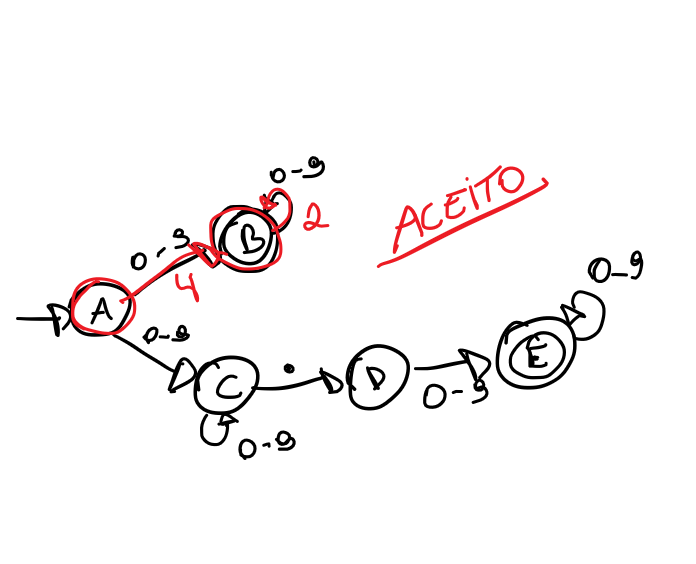
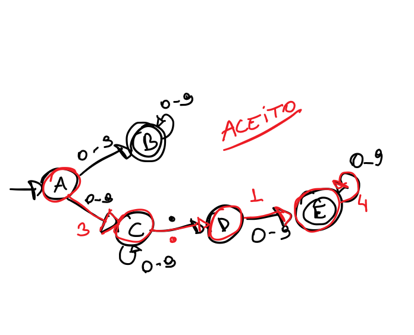
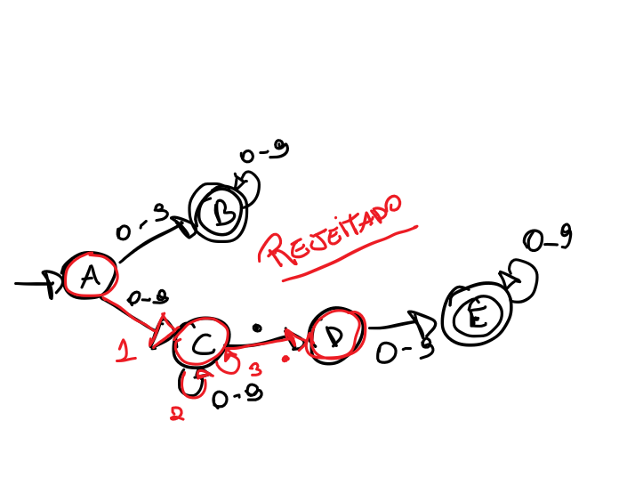
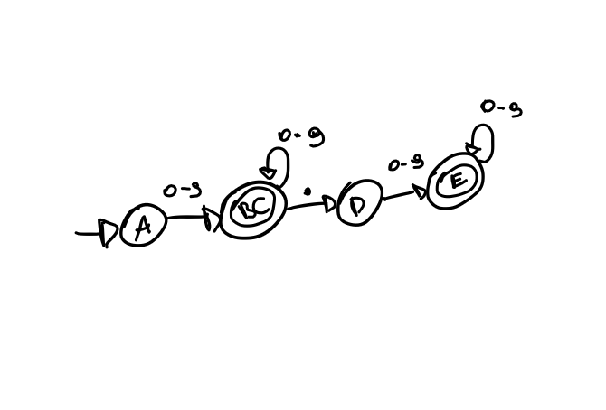

### Q1

1- O que faz com que o autômato seja classificado como um NFA e não um DFA?

`Um autômato é classificado como NFA quando cada par de estado e símbolo de entrada pode haver vários próximos estados possíveis`

2- Mostre o conjunto de estados que o autômato percorre para analisar as strings: a) 42 b) 3.14 c) 123. e diga em cada caso se a string foi aceita ou não.

a) 42

b) 3.14

c) 123.

3 -

