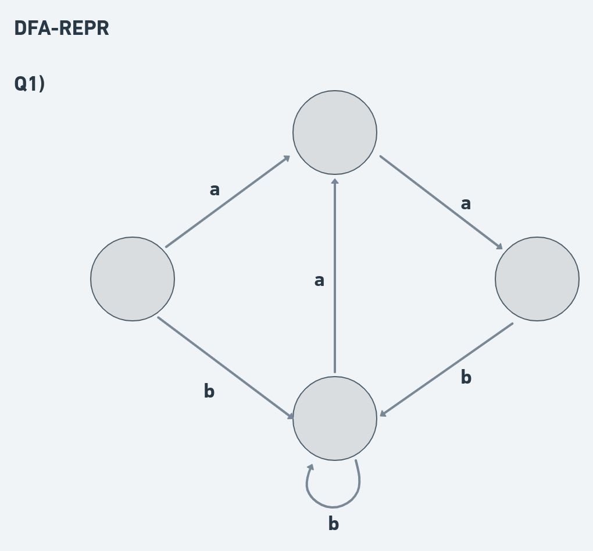

## [dfa-repr]: Entender o mecanismo de operação de um autônomo determinístico finito

**Q1)** Crie um autômato determinístico finito equivalente às linguagens abaixo. Em cada caso, faça um diagrama de operação do autômato, enfatizando as transições, estado inicial e estados de aceite e monte separadamente a tabela de transição. 

1. Sequências de a's e b's em que os a's aparecem em pares. Ex.: aa, baab, bbb, aaaab
2. Sequências de a's e b's com um número par de a's. Ex.: aa, abba, abaabbba
3. Sequências de a's e b's que contenham pelo menos uma ocorrência de cada letra.

Resolva 1 exemplo para demonstrar competência.

