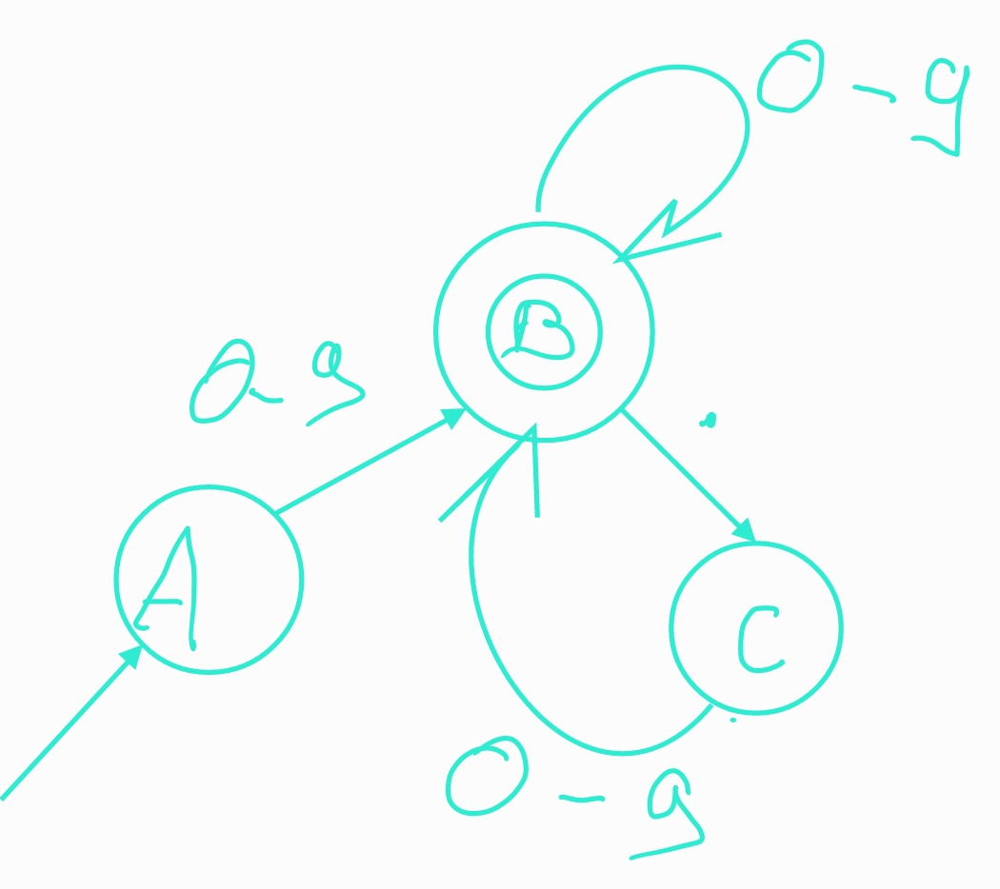
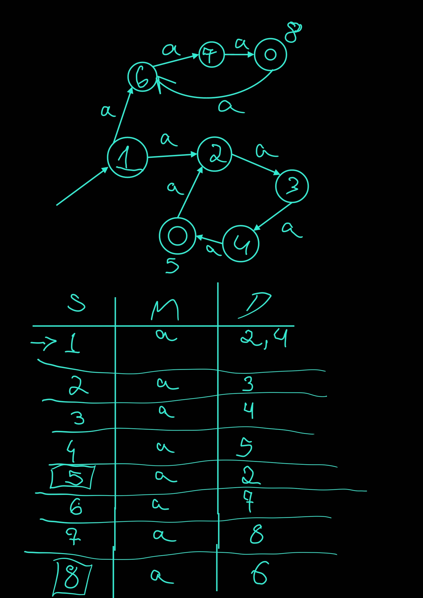

## Respostas:

### Q1) 
1. Este autômato é NFA pois um mesmo estado pode ter mais de uma transição com o mesmo símbolo.
2. 
    - a) {A->B->B}
    - b) {A->C->D->E->E}
    - c) {A->B->B->B}
3.  

### Q2)

1. 
 
