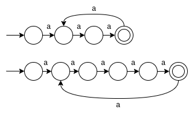

# Nfa-repr

## Q1

### 1.

A diferença entre um AFD e um AFND está na função de transição entre os estados. No AFND não necessariamente se tem apenas um caminho para um mesmo símbolo de entrada, enquanto no AFD, sim.

### 2.

a) A -> B  => Aceita

b) A -> C -> D-> E  => Aceita

c) A -> C -> C-> D  => Não aceita

### 3.

Uma pequena mudança que pode ser feita é retirar o estado B e atualizar o estado C para ser um estado final válido.
Realizando essas alterações e atualizando as letras dos estados para ficar coerente, chega-se a seguinte imagem:

## Q2

1.

