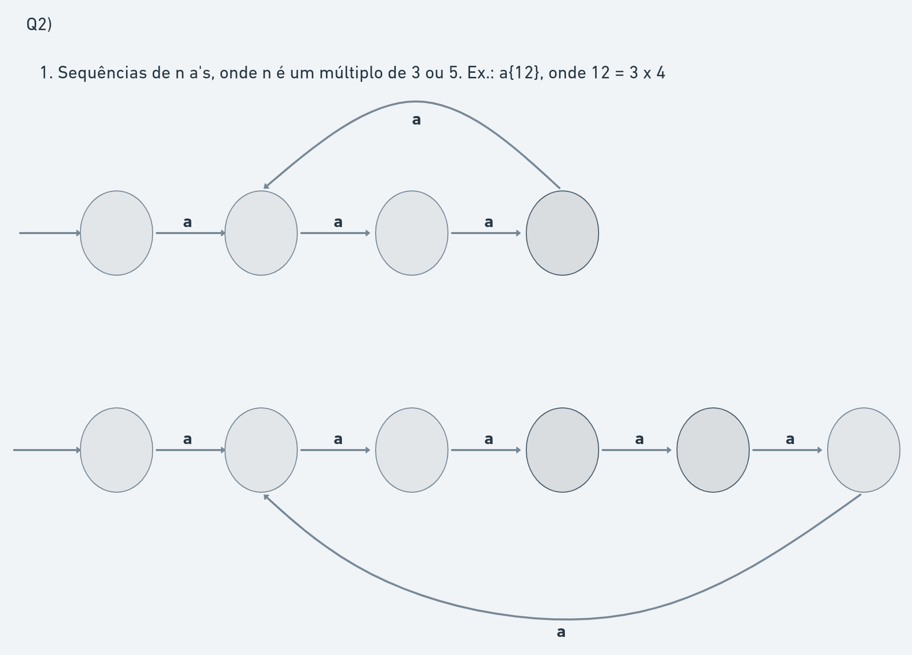

## [nfa-repr]: Entender o mecanismo de operação de um autônomo não-determinístico finito

Resolva as duas questões para demonstrar competência.

**Q1)** O autômato abaixo representa uma linguagem que aceita números inteiros ou números com parte decimal. 

1. O que faz com que o autômato seja classificado como um NFA e não um DFA?
2. Mostre o conjunto de estados que o autômato percorre para analisar as strings: a) `42` b) `3.14` c) `123.` e diga em cada caso se a string foi aceita ou não. 
3. Proponha uma mudança simples para transformá-lo em um DFA sem alterar a linguagem que ele representa.

### Q1)

### 2.
a) 

b) 

c) 

### 3.

**Q2)** Crie um autômato não-determinístico finito equivalente às linguagens abaixo. Em cada caso, faça um diagrama de operação do autômato, enfatizando as transições, estado inicial e estados de aceite e monte separadamente a tabela de transição. 

1. Sequências de n a's, onde n é um múltiplo de 3 ou 5. Ex.: a{12}, onde 12 = 3 x 4
2. Sequências de n a's, onde n pode ser dividido em partições de 3 ou 5 elementos. Ex.: a{13}, onde 13 = 3 + 5 + 5

Resolva 1 dos exemplos acima para resolver a questão.

