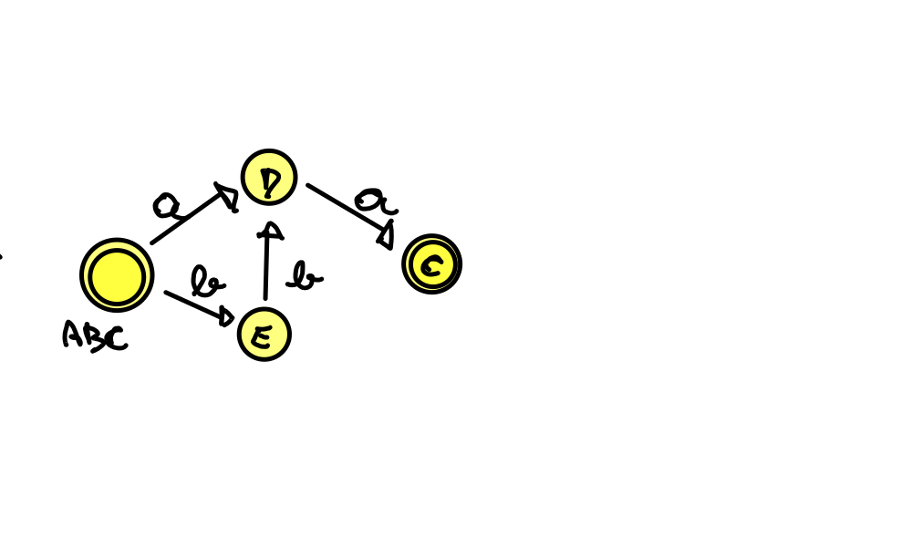
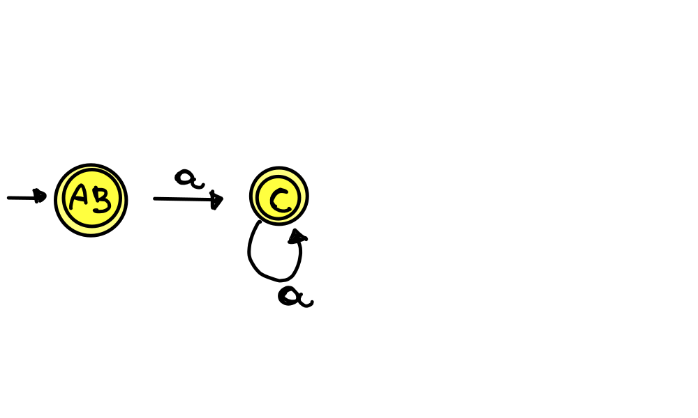

# NFA-DFA

## A

|     |  a  |  b  |  ε  |
| :-: | :-: | :-: | :-: |
|  A  |  D  |  E  |  E  |
|  B  |     |  E  |  C  |
|  C  |     |     |     |
|  D  |     |  E  |     |
|  E  |  C  |     |     |

- Logo:

|              |  a  |  b  |
| :----------: | :-: | :-: |
| -> **_ABC_** |  D  |  E  |
|      D       |     |  E  |
|      E       |  C  |     |
|   **_C_**    |     |     |

## B

|            |  a  |  ε  |
| :--------: | :-: | :-: |
| -> **_A_** |  C  | B,D |
| -> **_B_** |  C  |     |
|  **_C_**   |  C  | B,D |
|  **_D_**   |     |     |

- Logo

|             |  a  |  b  |
| :---------: | :-: | :-: |
| -> **_AB_** |  C  |     |
|   **_C_**   |  C  |     |

