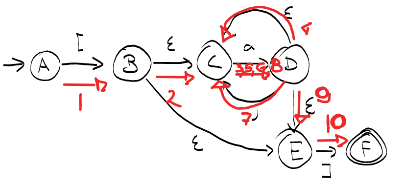

# NFA-EPSILON

## Q1

### 1



### 2

```
A-->B-->C-->D-->C-->D-->C-->D-->E-->F
  [   ε   a   ε   a   ε   a   ε   ]
```

## Q2

|            |  a  |  b  |  c  |
| :--------: | :-: | :-: | :-: |
| -> **_A_** |  B  |  C  |  D  |
| -> **_B_** |     |  C  |  D  |
| -> **_C_** |     |     |  D  |
| -> **_D_** |     |     |     |


|         |  a  |  b  |  c  |
| :-----: | :-: | :-: | :-: |
|  -> A   |  B  |     |     |
|    B    |  B  |  C  |     |
|    C    |     |  C  |  D  |
| **_D_** |     |     |  D  |


