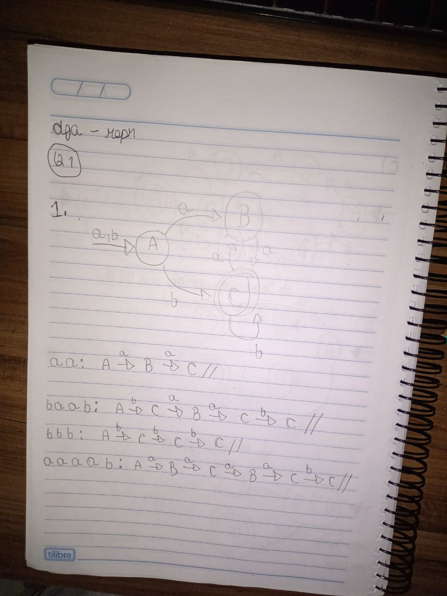
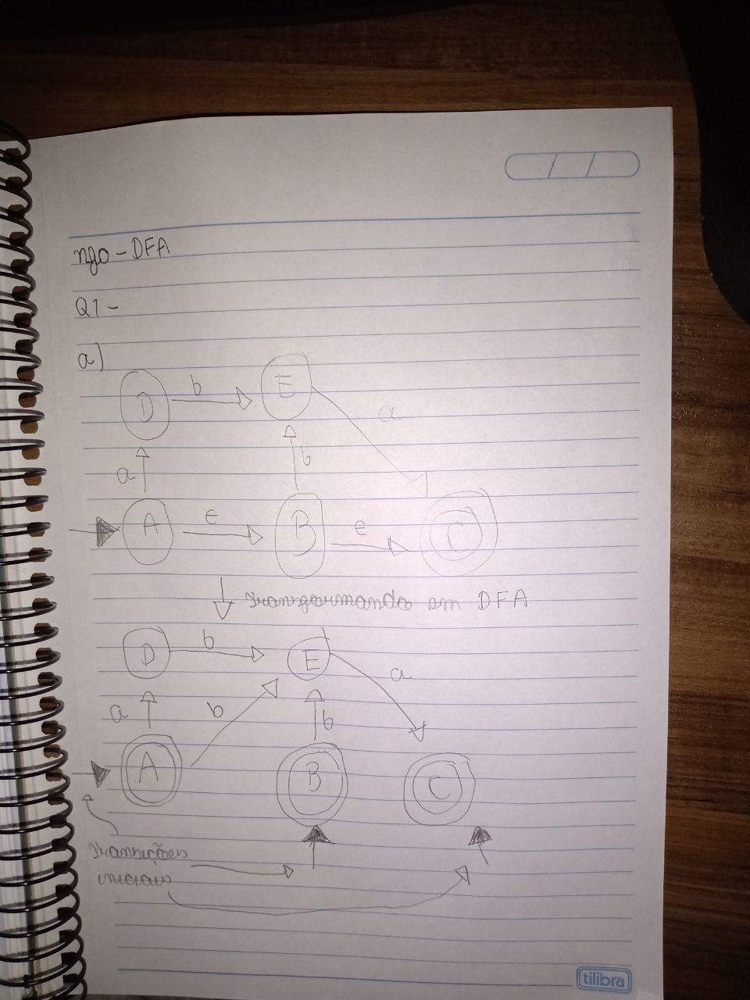
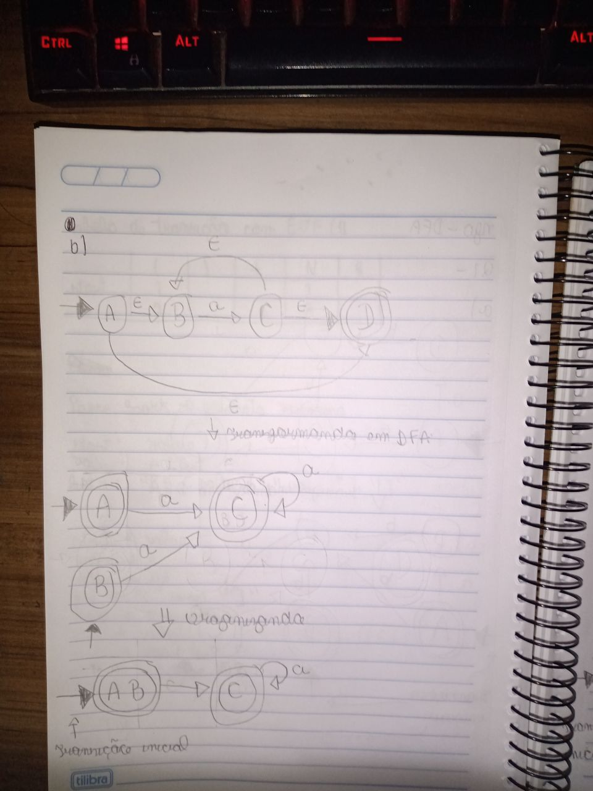

## dfa-repr

### Q1

1. 



<br>

## dfa-prog 


### Q1

```python
#===============================
# Autômato Determinístico Finito
#===============================

# Conjunto de estados válidos
Q = {"A", "B", "C", "D", "e"}

# Alfabeto de entrada
Σ = {"a", "b", "c"}

# Estado inicial
q0 = "A"

# Conjunto de estados finais
F = {"D"}

# Tabela de transição
δ = {
    ("A", "b"): "B",
    ("B", "a"): "B",
    ("B", "c"): "C",
    ("B", "b"): "D",
    ("C", "a"): "B",
    ("D", "b"): "A",
}


def automaton(δ, q0, F, input_string):
    state = q0
    
    for c in input_string:
        old = state
        try:
            state = δ[state, c]
        except KeyError:
            state = None
        print(f"{c}: {old} -> {state}")

    return state in F

st = input("Entrada: ")
print(automaton(δ, q0, F, st))
```

### Q2

```python
#===============================
# Autômato Determinístico Finito
#===============================

# Conjunto de estados válidos
Q = {"A", "B", "C", "D", "e"}

# Alfabeto de entrada
Σ = {"a", "b", "c"}

# Estado inicial
q0 = "B"

# Conjunto de estados finais
F = {"C"}

# Tabela de transição
δ = {
    ("A", "b"): "B",
    ("B", "a"): "B",
    ("B", "c"): "C",
    ("B", "b"): "D",
    ("C", "a"): "B",
    ("D", "b"): "A",
}


def automaton(δ, q0, F, input_string):
    state = q0
    
    for c in input_string:
        old = state
        try:
            state = δ[state, c]
        except KeyError:
            state = None
        print(f"{c}: {old} -> {state}")

    return state in F

st = input("Entrada: ")
print(automaton(δ, q0, F, st))
```

## nfa-dfa

### Q1

a.



<br>

b. 



<br>

c. 


