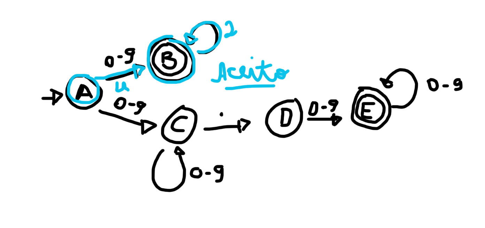
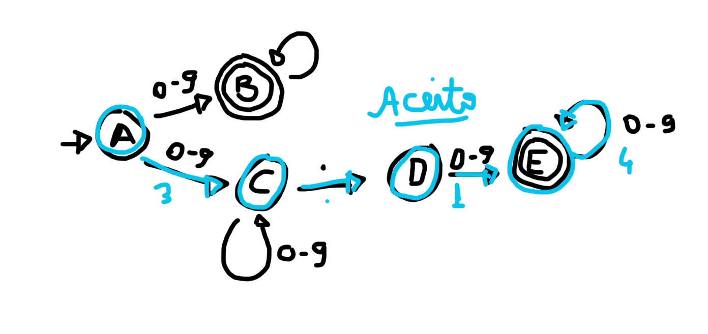
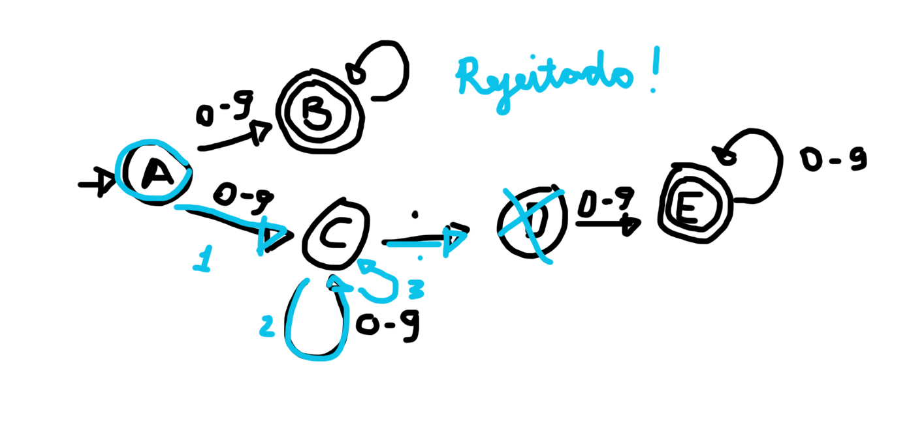
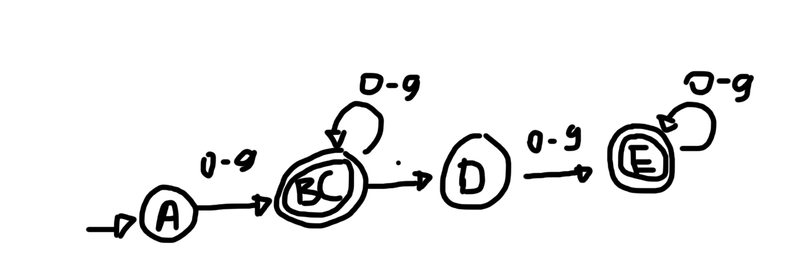
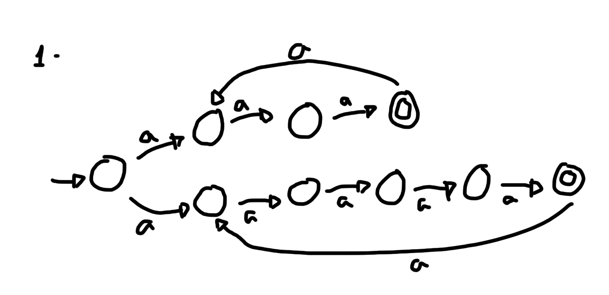

### **Q1)** 

**1** O que faz com que o autômato seja classificado como um NFA e não um DFA?

**Resposta**: Um NFA toma todos os caminhos possíveis para aquela entrada, e aceita entrada se pelo menos um caminho termina em um estado final.

**2** Mostre o conjunto de estados que o autômato percorre para analisar as strings: a) 42 b) 3.14 c) 123. e diga em cada caso se a string foi aceita ou não.

a) 
b) 
c) 

** 3** Proponha uma mudança simples para transformá-lo em um DFA sem alterar a linguagem que ele representa.

### **Q2)** 

