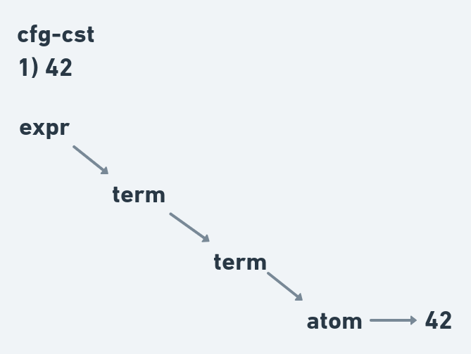
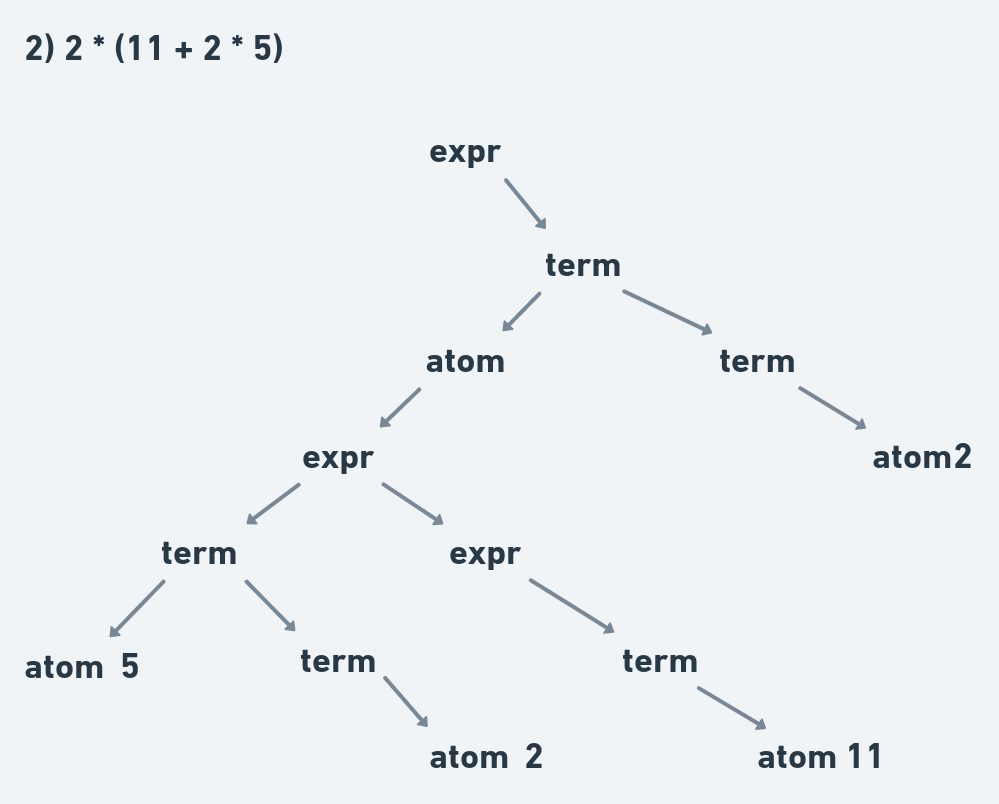

## [cfg-cst]: Relacionar gramática com a representação do código como árvore concreta 

**Q1)** A árvore sintática concreta representa um determinado elemento de uma linguagem como uma árvore que inclui **todos** lexemas como folhas e, deste modo, apresenta uma descrição 1:1 entre o código de entrada e a representação estruturada do mesmo. Usando a gramática abaixo, desenhe uma representação como árvore sintática completa das seguintes expressões:

1. 42
2. 2 * (11 + 2 * 5)

```
expr : expr "+" term
     | term

term : term "*" atom
     | atom

atom : NUMBER
     | "(" expr ")"

NUMBER : /\d+/
```

## 1



## 2

