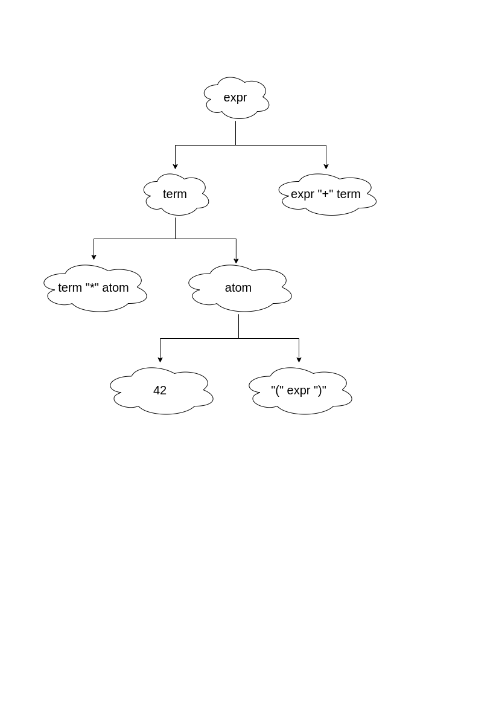
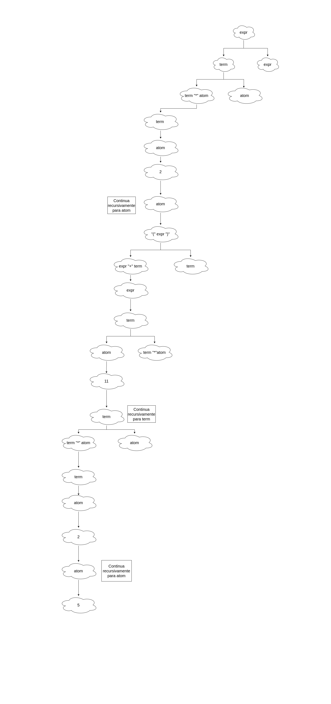
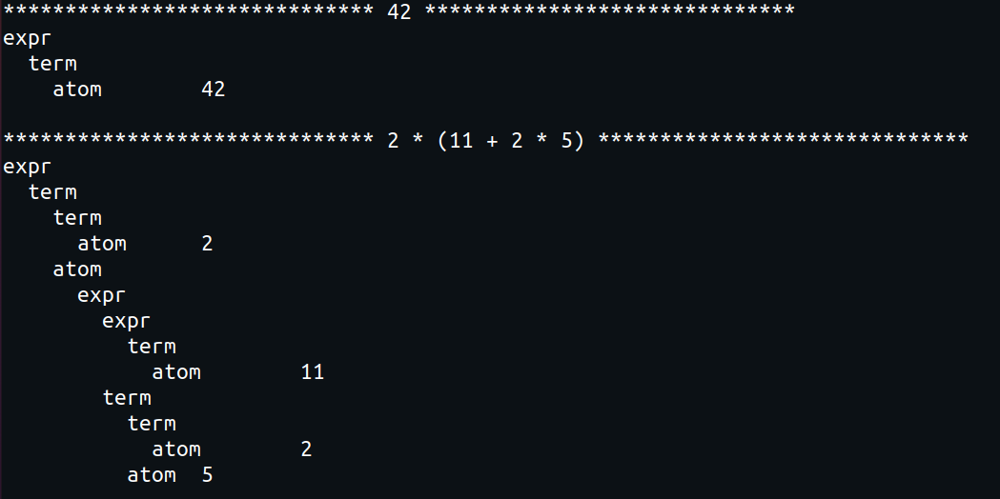

## cfg-cst


### Q1

1. 42



<br>

2. 2 * (11 + 2 * 5)



<br>

Foi utilizado o Lark para realizar a conferência das árvores geradas, como mostrado no código abaixo e sua execução.

```python
from lark import Lark

GRAMMAR = r"""
?start : expr

expr : expr "+" term
     | term

term : term "*" atom
     | atom

atom : NUMBER
     | "(" expr ")"

NUMBER : /\d+/
%ignore /\s+/
"""

srcs = ['42',  '2 * (11 + 2 * 5)']
grammar = Lark(GRAMMAR)


for src in srcs:
    print('*'*30, src, '*'*30)
    tree = grammar.parse(src)
    print(tree.pretty())
```




## cfg-sexpr

### Q1

```python
from lark import Lark, InlineTransformer

grammar = Lark(r"""
?start : expr

?expr  : expr "+" term     -> expr
       | term

?term  : term "*" atom     -> term
       | atom

?atom  : NUMBER            -> atom
       | "(" expr ")"

NUMBER : /\d+/
%ignore /\s+/
""")


class CalcTransformer(InlineTransformer):    
    def expr(self, *args):
        return ["+", *args] if len(args) > 1 else args

    def term(self, *args):
        return ["*", *args] if len(args) > 1 else args

    def atom(self, tk):
        return float(tk)


def ast(x):
    transformer = CalcTransformer()
    return transformer.transform(grammar.parse(x))

assert ast("42") == 42
assert ast("1 + 1") == ["+", 1, 1]
assert ast("1 + 2 * 3") == ["+", 1, ["*", 2, 3]]

```
