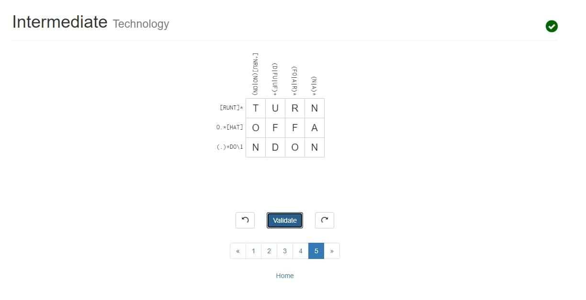

## Respostas
### Q1)
Regex          | String
======================================================
A=`0|1(1|0)*0`   | `010`
B=`(1|0)+`       | `101`
C=`1(11)*`       | `111`
D=`1|(11)*`      | ` `
E=`0*|1*`        | `00`

A -> {`010`}
B -> {`010`,`101`,`111`, `00`}
C -> {`111`}
D -> {}
E -> {`010`,`101`,`111`, `00`, ` `}

### Q2)
