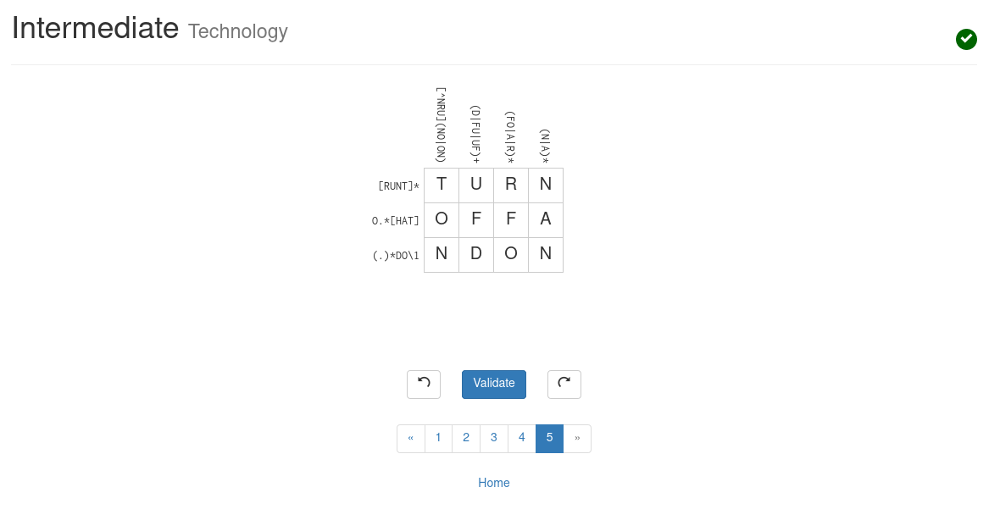

## [re-ler]: Compreender e elicitar a linguagem gerada por expressões regulares simples

Resolva 2 questões para ganhar a competência.

**Q1)** Associe a linguagem regular às strings incluídas em cada linguagem. A relação é de muitos para muitos.

------------------------------------------------------
Regex          | String
======================================================
`0|1(1|0)*0`   | `010`
`(1|0)+`       | `101`
`1(11)*`       | `111`
`1|(11)*`      | ` `
`0*|1*`        | `00`

**Q2)** Resolva um problema da categoria "intermediate" ou "experienced" do site Regex Crosswords (https://regexcrossword.com/challenges/intermediate/puzzles/5). Anexe um screenshot ou digite a resposta aqui como prova da solução.

TURN OFF AND ON 

**Q3)** Discuta se é possível criar um conjunto de exemplos de strings para cada linguagem em Q1 de tal forma que cada exemplo seja aceito por apenas uma linguagem? Em caso positivo, dê um exemplo e em caso negativo, explique o motivo. 

Não, pois em todas as regras estão definidas de forma parecida em cada exemplo, sendo assim. Cada regra existe em outra regra como uma subparte.