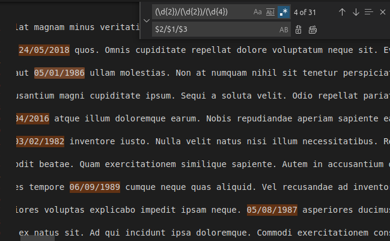

## [re-pat]: Aplicar expressões regulares para encontrar padrões de texto simples em um documento

<hr></hr>

### 1) O script em [arquivos/re-pat-q1.py] gera um texto que contêm várias datas no formato americano MM/DD/AAAA. Use uma regra de substituição que converta todas estas datas para o formato brasileiro DD/MM/AAAA. Diga qual expressão regular e qual regra de substituição foi utilizada no seu editor de código.

### Resposta:

O texto gerado se encontra no arquivo re-pat.txt

Abri o re-pat.txt no VSCode, realizei CTRL + F para abrir o Find in Text, clicando na setinha da esquerda abre a opção Replace, então inseri a regex (\d{2})/(\d{2})/(\d{4}) para encontrar as datas e depois $2/$1/$3 para substituir para o formato brasileiro DD/MM/AAAA.

Como ilustrado na imagem:




<hr></hr>

### 2) O arquivo [arquivos/re-pat-q2.py] gera um html algumas tags  que fazem referências a arquivos ".gif" como em . Crie uma expressão regular que encontre todas extensões .gif que aparecem dentro do atributo src das tags de img. Descreva como você poderia utilizar esta expressão em conjunto com alguma outra ferramenta para contar o número de ocorrências destas imagens no documento.


### Resposta:

O texto gerado se encontra no arquivo re-pat-2.txt

Utilizei a expressão:

``````

Via Find no VSCode.

O package <code>re</code> pode ser importado para utilizarmos então a sua função <code>re.findall()</code> para criar um iterável, e depois podemos pegar a sua quantidade de elementos com a função <code>len()</code>.

Ou simplesmente, em uma linha:

<code>len(re.findall(regex, entrada))</code>
